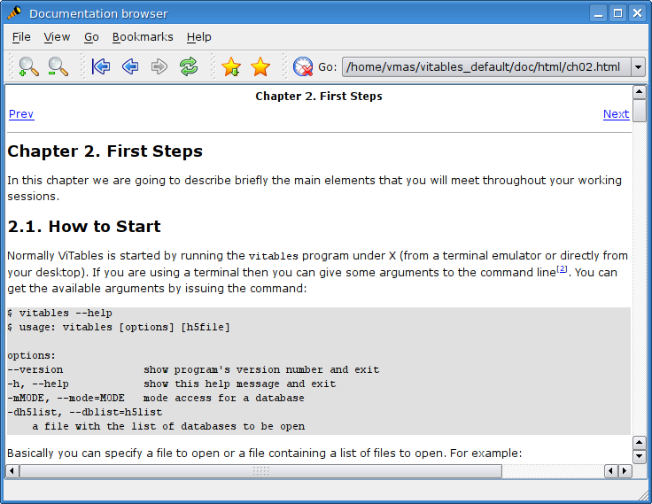

The Help Browser
================

*ViTables* comes with its own
fully-integrated documentation browser. It allows the
*ViTables* User's Guide to be browsed without
leaving the current working session and without opening external
applications. You can start the browser issuing the
:menuselection:`Help --> User's Guide`
command or from the toolbar.

The help browser is a small HTML browser for
*local* documents. Despite its small size it exhibits
some nice features

- bookmarks

- session history

- easy document navigation through navigation buttons

A nice feature of bookmarks is that they can be navigated while they are being edited with the Bookmarks
Editing dialog. Simply double click on a bookmark and it will be displayed in the browser.

.. _help-browser:

  The Users' Guide browser

