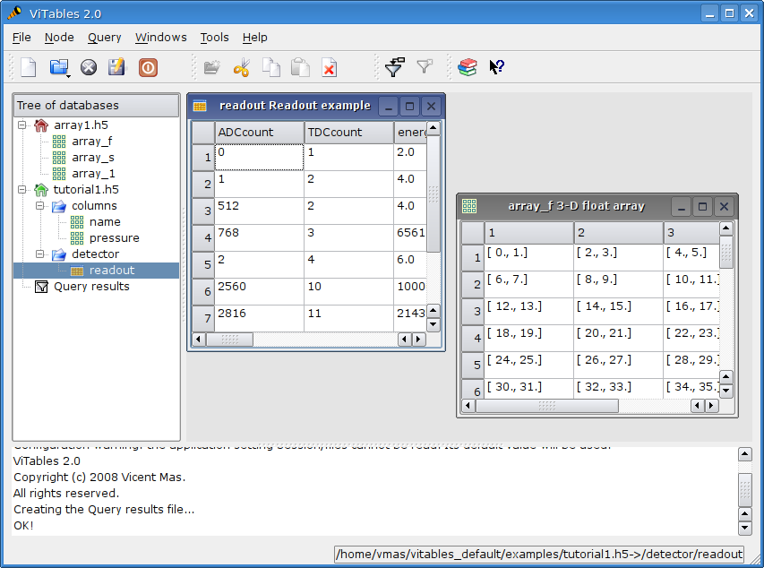
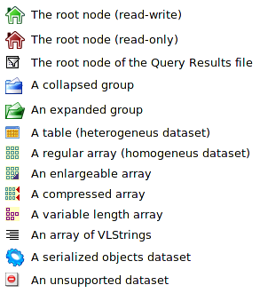

First Steps
===========

In this chapter we are going to describe briefly the main elements
that you will meet throughout your working sessions.

How to Start
++++++++++++

Usually *ViTables* is started by running
the :program:`vitables` program under X (from a terminal emulator
or directly from your desktop). If you are using a terminal then you can
give some arguments to the command line

Currently command
line arguments are available only in Linux platforms.
You can get the available arguments by issuing the command:

::

    $ vitables --help
    $ usage: vitables \[options] \[h5file]
    options:
    --version             show program's version number and exit
    -h, --help            show this help message and exit
    -mMODE, --mode=MODE   mode access for a database
    -dh5list, --dblist=h5list
    a file with the list of databases to be open

Basically you can specify a file to open or a file containing a list of
files to open. For example:

::

    $ vitables myh5file

will start *ViTables* and open the file myh5file
in read-write mode. If you want to open it in read-only mode then execute
the command:

::

    $ vitables -m r myh5file

In order to open a set of files at once put them in a list file with the
syntax

::

    mode path

(one pair per line) and execute:

::

    $ vitables -d h5list

Once the application is running the
:ref:`main window<main-window>` appears. It consists
of a :ref:`menu bar<menu-bar>`, a set of tool bars, a :ref:`viewing area<viewing-area>` and a status bar.

The viewing area of the window is divided into three parts. The
:ref:`tree of databases viewer<tree-pane>` is the narrow region placed at top left side. It will display a
tree representation of the data hierarchies we want to access. The big
panel next to the tree viewer is called the :ref:`workspace<workspace>`, and will display
the real data contained in a given node of the data hierarchy. Finally,
the bottom region is the :ref:`logger<logger>`, a kind of text non interactive console
where information about your requested operations will be shown.

As usual, you can launch commands from the menu bar, from
context menus or, if a shortcut button is available, from a toolbar.
Also keyboard shortcuts are available for most commands.

After starting your session, you are likely to open some files.
Just drag the file(s) you want to open into the tree of databases viewer and they
will be opened in read-write mode. Opening can be done from the file
manager dialog too; simply issue an open command,
:menuselection:`File --> Open File` (:kbd:`Ctrl-O`) and choose a file.

.. _main-window:

  The main window

.. _menu-bar:

The Menu Bar
++++++++++++

The menu bar is placed at top of the main window. It is composed of
six pulldown menus.

**File menu**

This menu contains commands to manipulate files in several ways:
open, close, create, save and so on. It also gives to you quick access to
the most recently opened files.

**Node menu**

The :guilabel:`Node` menu contains commands to manipulate the nodes displayed in the tree of databases viewer. From this menu
you can edit nodes in a variety of ways as well as access their
properties.

**Dataset menu**

With this menu you can make selects in any table (the result of
your selects will be available under the Query Results node in the
tree pane). The number of entries for this menu depends on the list of enabled plugins.

**Settings menu**

This is the menu from which the application can be customized.
Customization includes startup behavior, look and feel and plugins management. You can add/remove paths for
loading plugins, enable and disable
plugins. Changes in the enabled/disabled status of a given plugin take effect after restarting *ViTables*.  See 
:ref:`the ViTables Configuration chapter<configuration-chapter>` for more
information on this subject.

Also from this menu you can show, hide and
line up the application toolbars. At the moment four toolbars are
available, :guilabel:`File`, :guilabel:`Node`,
:guilabel:`Query` and :guilabel:`Help`.

**Window menu**

The :guilabel:`Window` menu can be used to change the arrangement of the
workspace contents, sorting the open windows as a cascade or as a tile.
By selecting a window name from this menu, you can raise (bring to the
front) that window. Any open window can be closed from this menu.

**Help menu**

The :guilabel:`Help` menu displays this User's Guide in :abbr:`HTML4` format and a
couple of *About* boxes, one for the *ViTables* itself and one for the underlying Qt libraries. The :guilabel:`Show Versions` entry shows the version numbers of the libraries
being used by *ViTables* (Qt, PyQt, PyTables and PyTables
related libraries, like Zlib or :abbr:`LZO`). Finally, from this menu you can
enter the *What's This* mode which will show context help for the components of the viewing area (the databases tree viewer, the workspace and the logger).

.. _viewing-area:

The Viewing Area
++++++++++++++++

As mentioned before, the viewing area is
divided into three regions: the databases tree viewer (also called tree
pane), the workspace and the
logger. Now we are going to describe these regions in more detail.

.. _tree-pane:

The Databases Tree Viewer
*************************

Due to the hierarchical model of the underlying :abbr:`HDF5` library,
PyTables files store their data on disk in a tree-like structure. Every
time you open a PyTables file, its so-called object tree (a
representation of the data hierarchy) is dynamically created and added to the tree of databases viewer, at the top left side of the viewing area (see :ref:`the main window Figure<main-window>`).

.. note:: since PyTables-1.2 the object tree of an opened file is made on demand: nodes are added to the tree when they are accessed. *ViTables* makes use of this feature, which results in stunningly fast opening times for files with a large number of nodes.

Any object tree is made of nodes which can be classified as follows:

.. glossary::

  Root node
    It is the node from which all other nodes hang.

  Groups
    Groups are nodes that can contain other nodes.

  Leaves
    Leaves are nodes that contain real data. They can be tables or arrays.

Working with object trees is really easy. By double-clicking
on it, a root node is opened, and the tree structure below it is
displayed. Groups are presented as
folders. They can be expanded with a double-click, giving you immediate
access to their contents. A group can contain groups and/or leaves (or
may be empty). A double click on a leaf will display its content on
the workspace. You can access the available options for a given node
just with a right mouse click on it. A context menu will appear from
which commands can be launched. The contents of the menu depend on the
kind of
node being clicked (root nodes, groups, tables and arrays have all of
them their own context menu). Alternatively you can select the node
with a single mouse click and choose a command from the
:guilabel:`Node` menu. There is also a context menu
for the tree pane itself that will pop up by right-clicking any empty
area of the tree viewer. Last but not least, the object tree can be navigated with the keyboard too. Pressing the Enter key
the selected node will be expanded (if it is a group) or opened (if it is
a leaf). The + and - keys expand an collapse groups.

Every node in a given object tree has an associated icon that
allows you to identify its type quickly. The following icons are
available:

.. _node-symbols:

  The node symbols

.. _workspace:

The Workspace
*************

At this point you should have one or more files opened, and their
object trees displayed in the databases tree viewer. Your next step will be to
select a leaf and display its data. Remember that the object tree
imitates the structure on disk, which makes it very easy to browse the
hierarchy of the file and locate the leaf you want to open.

A double-click on a leaf of your choice will open it and display
its contents in a window (a *view* in the
*ViTables* jargon) placed in the workspace, the big panel at the
top right side of the viewing area
(see :ref:`the main window Figure<main-window>`).

Note that the databases tree viewer and the workspace are always
synchronized: if you select a node in the tree viewer and that node has
a view, then that view becomes the active view on the workspace. The
opposite is also true, click on a view on the workspace and its node
will be automatically selected on the databases tree viewer.

The :guilabel:`Window` pulldown menu provides some
additional commands that will help you to manage your
views. From
this menu you can, for instance, rearrange views, see the
list of views (which is particularly useful when the workspace is
cluttered with so many views that it's difficult to find the one
you want) or close all the views at once.

There is also a context menu for the workspace. It can be used to change the workspace view mode: you can
display views as regular windows (default behavior) or with tabs in a tab bar. In addition it give you access
to the :guilabel:`Window` pulldown menu.

.. _logger:

The Logger
**********

The logger is a read-only (i.e. non interactive) console placed at the bottom of the viewing
area (see :ref:`the main window Figure<main-window>`). It is an
info panel where *ViTables* reports the result
of requested operations (namely if they were not successful).
Also runtime errors are caught and reported to you through the logger
(so you can mail the error to *ViTables*
developers and help to improve the quality of the package :-). Errors
and warning messages are highlighted in red and orange respectively.

Of course there is also a context menu for the logger that
provides you with some handy operations, like to copy selected text or
to empty the logger.

