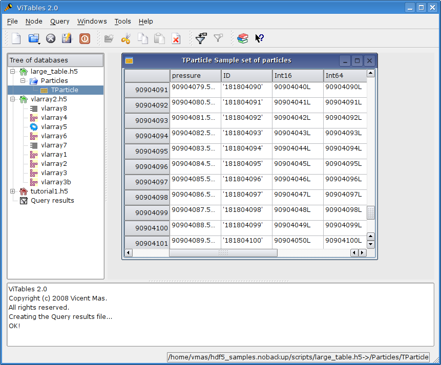
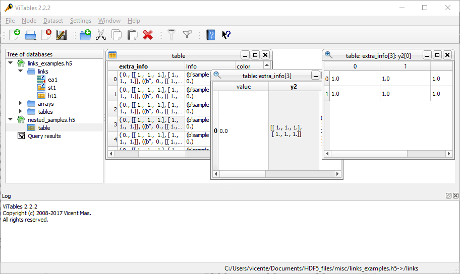
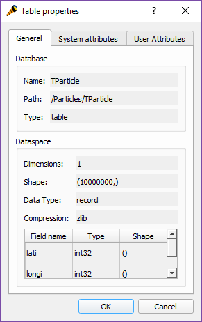
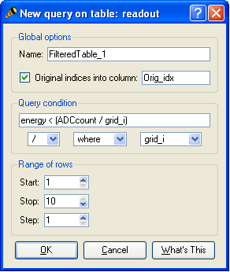

Browsing and Querying Datasets
==============================

In this chapter we are going to describe how the information
contained in a dataset can be navigated and filtered.

Browsing Datasets
+++++++++++++++++

A noticeable aspect of views is the visualization speed. Views show
data nearly as quickly as PyTables accesses them. As a consequence, very
large datasets (with up to 2^64 rows) can be browsed stunningly fast.

.. _browse-large-dataset:

  Browsing a large dataset

As said in the previous chapter, datasets are displayed in views. They are spreadsheet-like windows so can be navigated as you would expect:
via scrollbar, keyboard or wheel of mouse.

.. note::
  what makes *ViTables* views interesting is that *the navigation speed is independent of the view size*: a table with several thousand million rows is navigated as quickly as a table with just a few dozens rows.

Another interesting feature of views is the ability to zoom in on
cells that contain multidimensional data. When you double-click in a
cell,
it is displayed in its own view, reducing by two the number of
dimensions of the displayed data. For instance, a cell containing a
vector
is displayed as a one column table of scalars. A cell that contains
two-dimensional data will be shown as a bidimensional table of scalars.
And so on. In general, a cell containing N-dimensional data will be
displayed as a table of N-2 dimensions data. Zoom can be applied as many
times as needed, so that multi-dimensional cells can be inspected until
you get a table of scalars. Finally, if you try to zoom in on a cell that
contains a scalar value, this value will be presented alone in a view;
this can be useful to visualize large scalar values (for example, large
strings) that doesn't fit on regular columns.

.. _zoom-cell:

  Zooming a cell

Getting Info
++++++++++++

For a given node two kinds of information are available: metadata
and data. From their metadata you can retrieve information about the
objects on disk, such as table and column names, titles, number of rows,
data types in columns or attributes, among others.

The available metadata about a given node (group or leaf) can be
accessed by right-clicking the mouse on the node and launching the
:guilabel:`Properties` command from the context menu
that appears. This can also be achieved from the :guilabel:`Node`
menu. Then the :ref:`Properties dialog <properties_dialog>`,
that contains the requested metadata, is displayed. The dialog is made of
three tabs labelled as General, System attributes and User attributes.
The General tab contains generic information about the selected node,
i.e. name, path, etc. The System and User tabs
contain tables that describe the attributes of the node.

.. _properties_dialog:

  The Properties dialog

Aside from the Properties dialog, you can get information in
several other ways.

The full path of the node currently selected in the tree view is
displayed in the status bar. This can be
useful when the object tree is large and guessing a full path is not
easy.

The top left icon of views shows the kind of displayed data
(array or table).

Finally, some generic information can be obtained by launching the
command
:menuselection:`Help --> WhatIsThis`
(or clicking the appropriate button on the corresponding toolbar).

Querying Tables
+++++++++++++++

An interesting feature of *ViTables* is its capability to make table selections.
This means that we can select a set of table rows that fulfill a given condition. You can filter any table
(even if it is closed) by issuing the command

:menuselection:`Dataset --> Query…`
A dialog (see :ref:`this Figure<query_dlg>`) will
be displayed where you can create a query and select the range of rows to
which the query will apply. Notice that, *you can make
complex queries, i.e. queries that involve more than one table field.
However the queried fields cannot be multidimensional or contain data
with Complex data type*.

*ViTables* always do its best for not being frozen due to out of memory problems when you do complex queries or the queried table is huge (or both) but it is not guarateed that it can achieve this goal.

The selected rows are stored in a new table (but not removed from
its original location) that we will call filtered table from here on.
Filtered tables are stored in a temporary database [#f2]_ labeled as *Query results* in the databases tree viewer. The *Query results* node is always placed at the bottom of the databases tree.

Filtered tables can be edited as any other leaf opened in read-write mode.

By default an automatic title FilteredTable_X is given to the X-th filtered table created. In addition, those tables have three user attributes that are, in principle, only defined for filtered tables.
These attributes are:

.. glossary::

  query
    the applied query

  query_path
    the full path of the queried file

  query_table
    the full path of the queried table in the object tree hierarchy

.. _query_dlg:

  The New Query dialog

.. rubric:: Footnotes

.. [#f2] Every time a *ViTables* session starts, a new temporary database is created from scratch. This database has a flat structure and is stored with a unique name in a temporary directory so the operating system will remove it every time the directory is cleaned.

