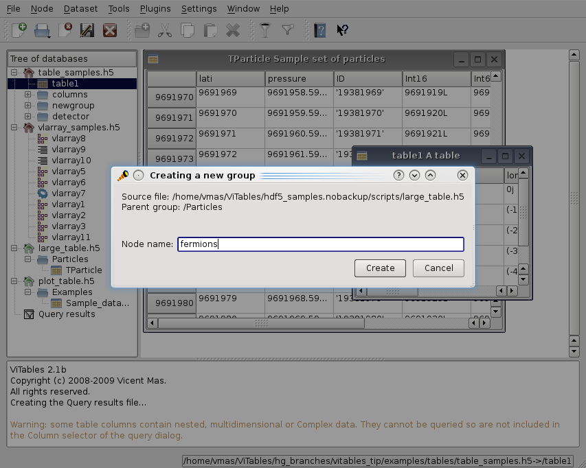
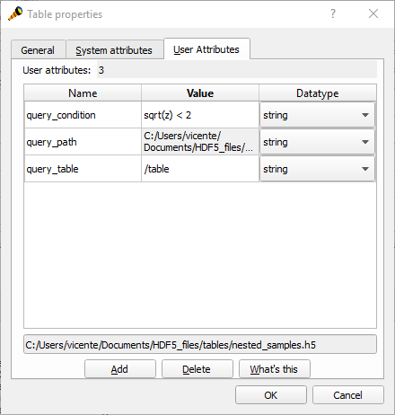

Editing Files
=============

In this chapter we are going to describe briefly the editing
capabilities of *ViTables*.

Creating Complex Hierarchies
++++++++++++++++++++++++++++

*ViTables* supports a complete set of
editing operations on files and nodes. The result of these operations is
made immediately visible on the databases tree viewer.

To create a new file in write mode, just issue the command :menuselection:`File --> New…` (:kbd:`Ctrl-N`).
By default, the file will be created with a ``.h5``
extension but you can provide your desired extension.

You can add new empty groups to a writable file as easily as you
create a new file. Simply select a group on the the tree pane and launch
the command
:menuselection:`Node --> New group…`.
A new, empty group will be added to the previously selected group. By
combining this operation with file creation, you can easily create
complex hierarchies. Later on, you can populate the hierarchies with real
data using your PyTables programs.

.. _group-creation:

  Creating a new group

Editing Object Trees
++++++++++++++++++++

Files opened in write mode can be modified by moving their nodes
(groups and leaves) around. From the
:guilabel:`Node`
menu you can copy, paste, cut, rename or delete any selected node
(except root groups). Typical keyboard shortcuts are available for copy
and paste operations. Of course, you can drag and drop nodes from one
location to a different one using the mouse.

Nodes can be moved to a different location in the object tree, but
can also be reallocated in a different file. This way you can
*merge* open files in a very flexible and comfortable
way.

As usual, while an operation is being performed on a given node,
the shape of the mouse cursor will change into a clock, reminding you
that a PyTables operation is being executed.

Given a node opened in read-write mode you can edit its user attributes from
the User attributes page
(see :ref:`this Figure<editing_user_attributes>`)
in the node Properties dialog. This page contains the user attributes
table. You can add and remove attributes with the respective buttons or
you can edit any existing attribute by clicking the table cell that you
want to modify and introducing the new value. This way you can change
name, value and type of any existing attribute.

.. note:: multidimensional attribute values are not supported by *ViTables*. Also be aware that scalar attributes will be saved as scalar Numpy objects instead of serialized using cPickle (which used to be the default PyTables behavior). This way you will be able to read them using generic :abbr:`HDF5` tools, not just PyTables.

Finally, the value of the TITLE system attribute can also be
edited.
Just click its cell in the System Attributes tab and enter the desired
value.

.. _editing_user_attributes:

  Editing user attributes

Editing Leaves
++++++++++++++

At the moment of writing, editing the real data stored in leaves
has not yet been implemented.

